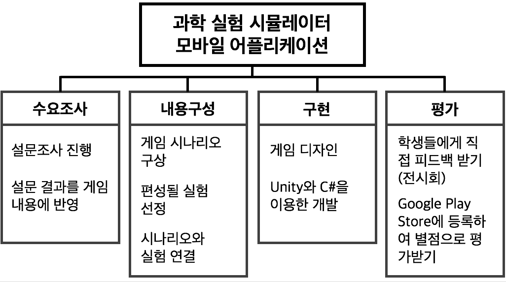
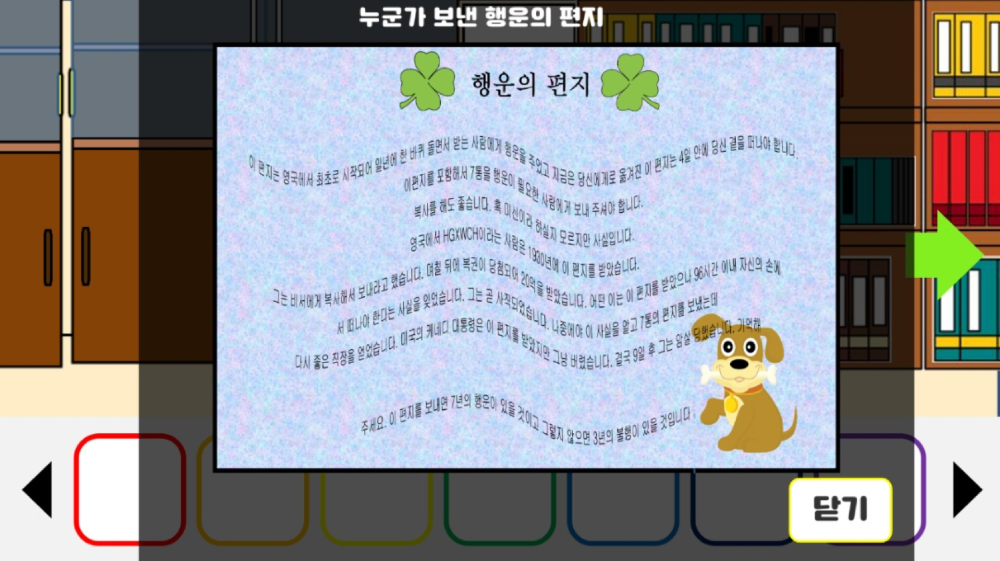

# 2016년

#### 제주대학교 과학영재교육원 정보영재 조교

> * 2016년도 여름
> * 대상 : 중학생
> * 내용 : App Inventor, Scratch

* * *

# 2017년

#### 제주대학교 컴퓨터교육과 멘토링 보조멘토

> * 2017학년도 1학기
> * 대상 : 대학생
> * 내용 : C언어
> * 

#### [VR 및 게임개발을 위한 Unity 3D] 교육 수료

> * 2017.06.22 ~ 2017.06.26(40h)
> * 주관 : 제주대학교 공학교육혁신센터, 제주테크노파크 디지털융합센터
> * 지원 : 미래창조과학부, 제주특별자치도

#### [2017 WISET 창의적 공학연구캠프] 멘토

> * 2017.07.16
> * 대상 : 중학생, 고등학생
> * 내용 : Entry
> * 최우수멘토상 수상^ㅁ^v
> * 

#### [코딩 강사 양성과정] 수료

> * 2017.07.10 ~ 2017.07.26(73h)
> * 주관 : 제주창조경제혁신센터
> * 후원 : 제주특별자치도, 제주대학교, Kakao

#### 제주대학교 과학영재교육원 중등컴퓨팅융합트랙 심화과정 조교

> * 2017년도 여름
> * 대상 : 중학생
> * 내용 : Python

#### WISET 찾아가는 실험실 멘토

> * 2017.08.25
> * 대상 : 중학생
> * 내용 : Arduino
> * 

#### 제주대학교 [창의융합코딩] 강의 조교

> * 2017학년도 2학기
> * 대상 : 대학생
> * 내용 : Python, R, Arduino

#### 제주대학교 Kakao 트랙 장학생

> * 2017학년도 1학기, 2학기

* * *

# 2018년

#### 국가공인 [리눅스마스터 2급] 취득

> * 2018.03.23
> * 발급기관 : 한국정보통신진흥협회

#### [카카오와 함께하는 찾아가는 코딩교실] 주강사, 보조강사

> * 2018.05.12 ~ 2018.06.09
> * 대상 : 초등학생
> * 내용 : Scratch, Microbit
> * 

#### [제주로 On 코딩] 전문강사 심화 과정 수료

> * 2018.05.12 ~ 2018.06.30
> * 시행 : 제주특별자치도

#### Coding Specialist 1급 / Advanced (Scratch, 한글) 취득

> * 2018.05.19
> * 발급기관 : (주)와이비엠넷
> * 비고 : 만점인 1,000점으로 합격함^ㅁ^v

#### [프로젝트] 가상현실 콘텐츠를 이용한 1차 방어 작용 자기주도학습 애플리케이션

> * 2018년 1학기 
> * 개발 환경 : Unity
> * 개발 언어 : C#
> * 세부 개발 내용

#### 2018 제주대학교 해외파견 어학연수 프로그램 선발

> * 2018.07.07 ~ 2018.08.09
> * 국가 : 영국
> * 언어 : 영어
> * 교류 대학 : Sheffield University
> * 지원 : 제주특별자치도

#### [프로젝트] 과학 실험 시뮬레이터 모바일 애플리케이션

> * 2018년 2학기
> * 개발 환경 : Unity
> * 개발 언어 : C#
> * 게임 시나리오

> * 세부 개발 내용

